
  

- 🔭 I’m currently working as **Mobile Developer**

- 🌱 I’m currently learning **SwiftUI, UIKit**

- 💬 Ask me about **Flutter,Dart**

- 📫 How to reach me **Ahmed11h62@gmail.com**

- 📄 Know about my experiences [https://drive.google.com/file/d/19b7K2sEMRC8C9PGUaJt1AcTe18Nnk--0/view?usp=sharing](https://drive.google.com/file/d/19b7K2sEMRC8C9PGUaJt1AcTe18Nnk--0/view?usp=sharing)

<h3 align="left">Connect with me:</h3>

<h3 align="left">Languages and Tools:</h3>

               

<h2> Samples from my Live projects </h2>

### El-Daan El-3araby | الضأن العربي

● Built simplifies the process of acquiring sacrificial animals for religious festivals. This easy-to-use mobile application allows you to browse, select, and purchase high-quality livestock directly from your phone. 
● Multiple Payment Methods: Choose preferred payment method for a smooth and secure transaction using my fatoraah payment gateway. 
● Integrated Google Maps: Locate user place for deliver the product. 

    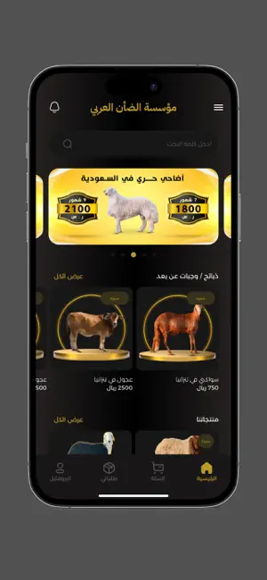
    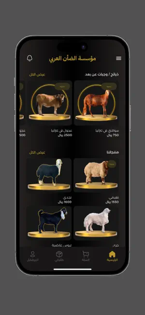
    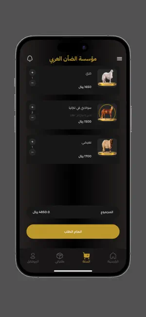
    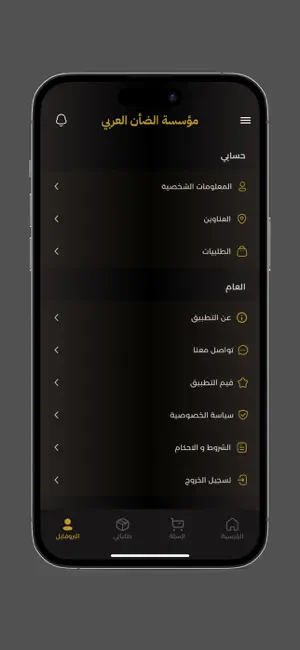

  

### Bnoni sway - بنوني سواي

● Developed two applications targeting the Saudi and Emirati markets: a doctor's application for patient follow-up and a user. 
● Application for menstrual cycle tracking. Increased user engagement by implementing interactive charts to visualize data related to menstrual cycles, moods, symptoms, and other health metrics.

    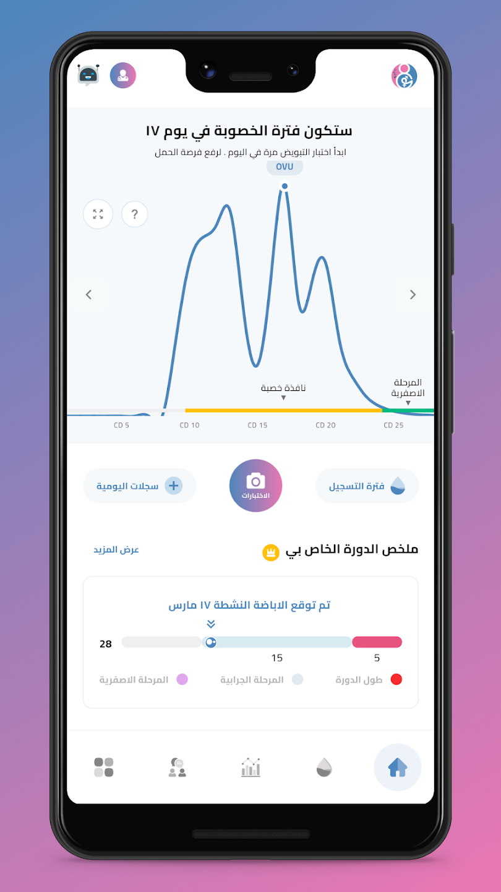
    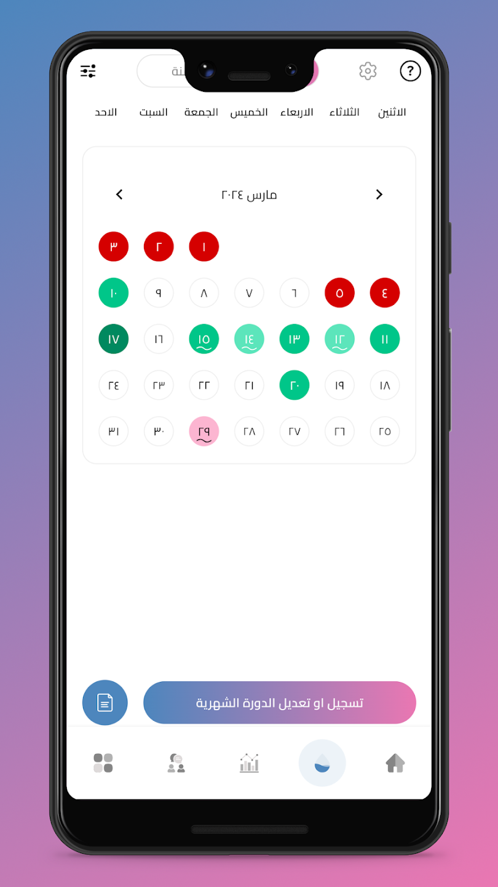
    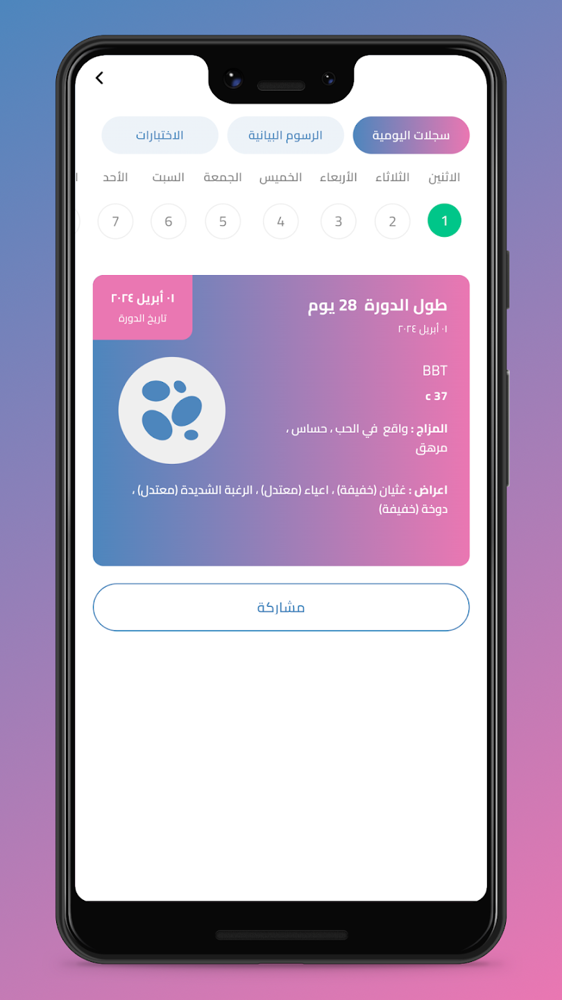
    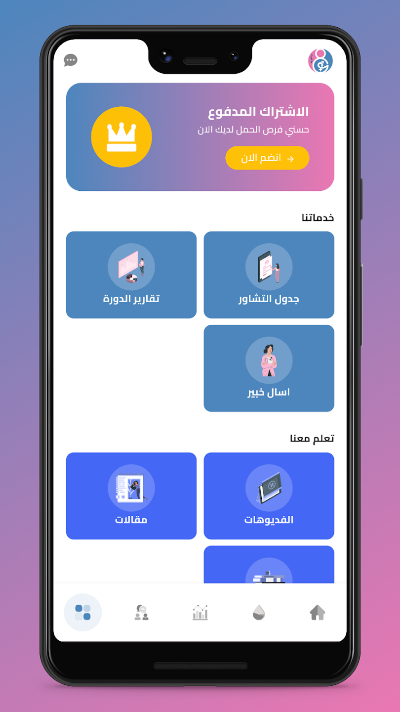

  

### Bnoni-Sway - Doctor

● Developed two applications targeting the Saudi and Emirati markets: a doctor's application for patient follow-up and a user. 
● Application for menstrual cycle tracking. Increased user engagement by implementing interactive charts to visualize data related to menstrual cycles, moods, symptoms, and other health metrics.

    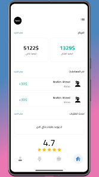
    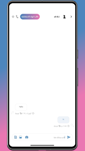
    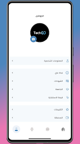
    

  

<h2> Samples from my random projects </h2>

### MVVM_GetX

A Flutter application structured using the MVVM (Model-View-ViewModel) architecture pattern, leveraging GetX for state management, dependency injection, and routing. This architecture ensures a clean separation of concerns, scalability, and maintainability.

    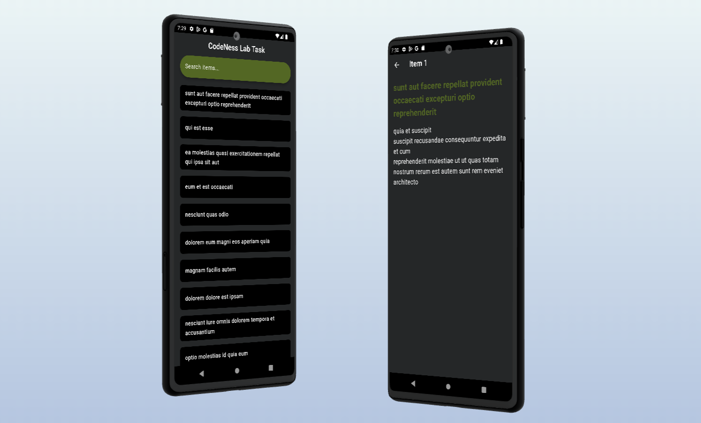

 <a href="https://github.com/AhmedHusseinHafez/MVVM_GetX" target="_blank">

### Dynamic Dashboard

A Flutter application for Dashboard adaptive for different screen sizes (mobile-tablet-pc).

    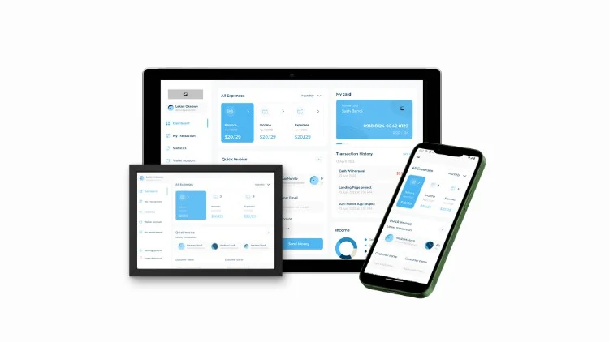

 <a href="https://github.com/AhmedHusseinHafez/Dynamic_Dashboard" target="_blank">

